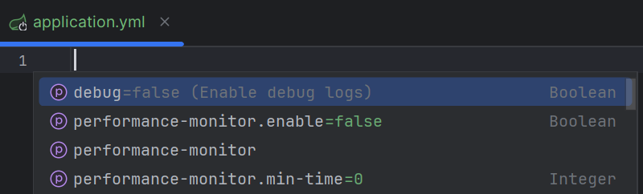
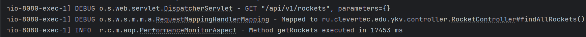

# Performance Monitoring Starter

### spring-boot-monitor-performance-starter

Spring Boot Starter для добавления функциональности мониторинга времени выполнения методов и логирования результатов.

## Описание

- аннотация `@MonitorPerformance` используется для пометки методов, для которых нужно выполнить мониторинг
- `PerformanceMonitorAspect` логирует методы, помеченные аннотацией `@MonitorPerformance`
    - если функция логирования не отключена
    - если время выполнения превышает минимальное время
    - данные логируются в следующем виде: `Method [methodName] executed in [executionTime] ms`
- `PerformanceMonitorProperties` используется для хранения данных, указанные в application.yml/application.properties

## Технологии

- Java 21
- Spring Boot 3.2.3
- Lombok

## Configuration properties

"spring-boot-monitor-performance-starter" поддерживает следующие свойства конфигурации.
Они настраиваются с помощью "application.yml/application.properties".

```
performance-monitor:
  # Включение/отключение функции мониторинга времени
  # Значение по умолчанию false 
  enable: true
  # Минимальное время, при котором произвадится логирование (в милисекундах)
  # Значение по умолчанию 0
  min-time: 865
```

## Использование

Для добавления мониторинга времени выполнения метода необходимо добавить аннотацию @MonitorPerformance

``` java
import lombok.RequiredArgsConstructor;
import org.springframework.stereotype.Service;
import ru.clevertec.edu.ykv.domain.Rocket;
import ru.clevertec.edu.ykv.entity.RocketEntity;
import ru.clevertec.edu.ykv.mapper.RocketMapper;
import ru.clevertec.edu.ykv.repository.RocketRepository;
import ru.clevertec.monitorstarter.annotation.MonitorPerformance;

import java.util.List;

@Service
@RequiredArgsConstructor
public class RocketService {

    private final RocketRepository rocketRepository;
    private final RocketMapper rocketMapper;

    @MonitorPerformance
    public List<Rocket> getRockets() {
        List<RocketEntity> rockets = rocketRepository.getRockets();
        return rocketMapper.toDomains(rockets);
    }
}

```

При выполнении мониторинга будут считаны указанные свойства в "application.yml" / "application.properties"



## Пример вывода



## Установка

Соберите стартер с помощью команды:

```bash
./gradlew clean build
```

Публикация стартера в локальный репозиторий с помощью команды:

```bash
./gradlew publishToMavenLocal
```

Стартер будет опубликован в локальном Maven-репозитории (~/.m2/repository).

Добавьте зависимость в ваш проект

Gradle:

```
dependencies {
  implementation 'ru.clevertec:spring-boot-monitor-performance-starter:0.0.1'
}
```

Maven:

```
<dependency>
    <groupId>ru.clevertec</groupId>
    <artifactId>spring-boot-monitor-performance-starter</artifactId>
    <version>0.0.1</version>
</dependency>
```
